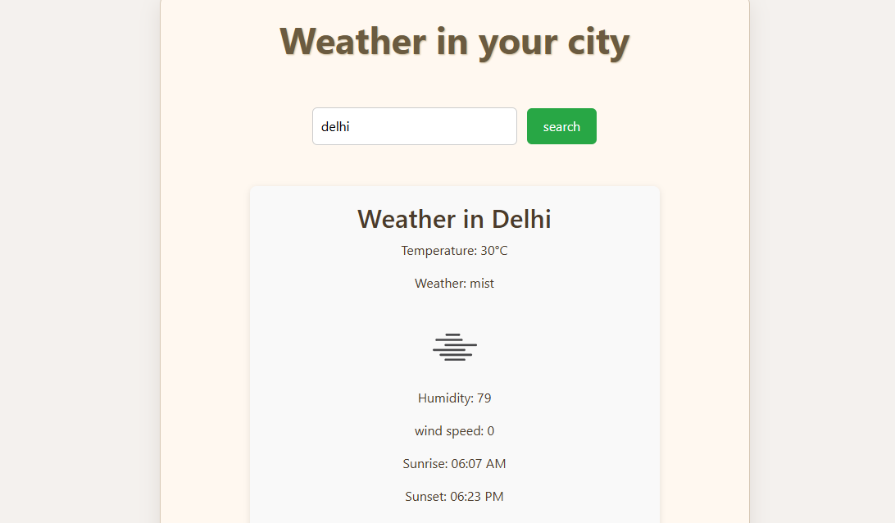

# 🌤️ Weather App

A simple and responsive weather application built with **React** that allows users to search for real-time weather information by city. The app fetches data from the **OpenWeatherMap API** and displays key weather metrics such as temperature, humidity, wind speed, weather conditions, and sunrise/sunset times.

---
## 📸 Screenshot

## 🚀 Features

- 🔍 Search weather by city name  
- 🌡️ Displays temperature in Celsius  
- 💧 Shows humidity, wind speed, and weather description  
- 🌅 Sunrise and 🌇 sunset times (converted from UNIX time)  
- 🖼️ Dynamic weather icons based on conditions  
- ✅ Responsive and mobile-friendly design  
- ⚠️ Graceful error handling for invalid searches  

---

## 🛠️ Tech Stack

- **React** (Functional Components + Hooks)  
- **CSS** (Responsive styling with Flexbox)  
- **OpenWeatherMap API**

---

## 📦 Installation & Setup

**Clone the repository:**

   git clone https://github.com/thanushreeDN12/weather-app.git
   cd weather-app
   Install dependencies:
   
   npm install
   
   Add your OpenWeatherMap API key
   
   Create a .env file in the root directory:
   REACT_APP_API_KEY=your_api_key_here
   Start the app:
  
   npm start
   The app will run at http://localhost:3000.
